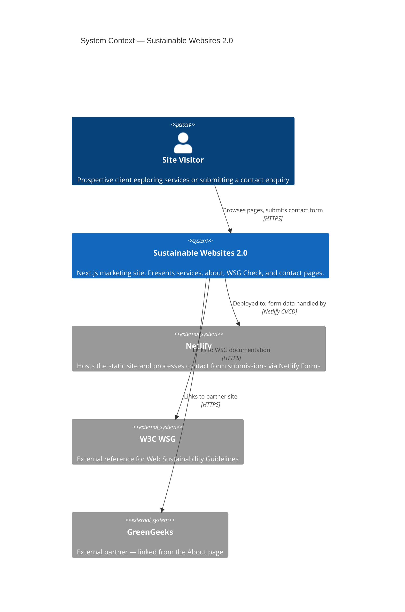
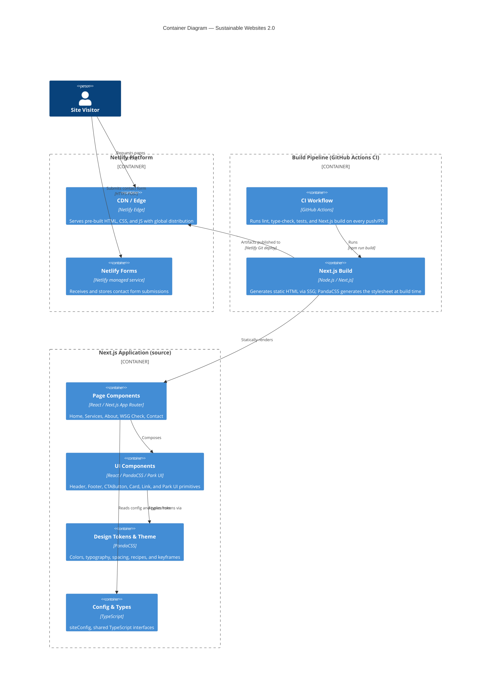

# Architecture Overview

Sustainable Websites 2.0 is a static-first marketing and consulting site built
with Next.js, deployed to Netlify. The system applies the
[C4 model](https://c4model.com/) to describe context, containers, and
components.

## C4 Level 1 — System Context

The diagram below shows the system and its primary actors and external
dependencies.

## C4 Level 2 — Container Diagram

The diagram below shows the major runtime and build-time containers.

## Component Overview

### Pages (App Router)

All routes live under `app/` using the Next.js App Router. Every page exports
static metadata and is rendered as a Server Component, producing zero
client-side JavaScript unless explicitly required.

| Route | File | Purpose |
| --- | --- | --- |
| `/` | `app/page.tsx` | Hero, benefits summary, service teasers, CTA |
| `/services` | `app/(pages)/services/page.tsx` | Full service cards (Audit, Architecture, DevOps) |
| `/about` | `app/(pages)/about/page.tsx` | Founder story, mission, WSG context |
| `/wsg-check` | `app/(pages)/wsg-check/page.tsx` | Placeholder for the WSG audit tool |
| `/contact` | `app/(pages)/contact/page.tsx` | Netlify Forms contact form |

### Layout

`app/layout.tsx` wraps every page with `<Header>`, `<main>`, and `<Footer>`.
It also exports shared `Metadata` (title template, description) and a
`Viewport` configuration derived from `siteConfig`.

### Application Components (`app/components/`)

| Component | Description |
| --- | --- |
| `Header` | Site-wide navigation bar; reads nav links from `siteConfig` |
| `Footer` | Site-wide footer with copyright notice |
| `CTAButton` | Styled anchor wrapped in Park UI `Button`; supports `primary`/`secondary` variants and `sm`/`md`/`lg` sizes |
| `Card` | Wraps Park UI `Card`; optionally rendered as a link when `href` is supplied |
| `Link` | Styled anchor with `primary`, `nav`, `brand`, and `subtle` variants; sets `rel="noopener noreferrer"` for external links |

### Park UI Primitives (`app/components/ui/`)

Thin wrappers around Ark UI components styled with PandaCSS recipes. Exported
from a single `index.ts` barrel: `Button`, `Card`, `Field`, `Input`, `Textarea`,
`Select`, `Spinner`, `Loader`, `Group`, `Span`, `AbsoluteCenter`.

### Design System (`theme/`)

PandaCSS configuration (`panda.config.ts`) references:

- **Color tokens** — `sage` (gray scale), `green`, `grass`, `blue`, `red`
- **Semantic tokens** — `fg.default`, `fg.muted`, `border`, `error`, `blue`, `gray`, `green`
- **Recipes** — per-component style variants for `Button`, `Card`, `Field`, `Input`, `Textarea`, `Select`, `Spinner`, `Group`
- **Text styles, layer styles, keyframes, animation styles** — global typography and motion

### Config and Types (`app/lib/`, `app/types/`)

`siteConfig` in `app/lib/config.ts` is the single source of truth for the site
name, description, and navbar links. Shared TypeScript interfaces (`SiteConfig`,
`NavLink`, `CTAButtonProps`, `CardProps`, `PageProps`) live in `app/types/index.ts`.
