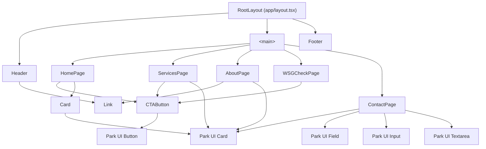

# Component Architecture

This document describes the UI components in Sustainable Websites 2.0, their
responsibilities, and how they compose.

## Component Hierarchy

## Application Components

### `RootLayout` — `app/layout.tsx`

The root server component that wraps every page. Responsibilities:

- Renders the `<html lang="en">` and `<body>` elements.
- Imports and applies the PandaCSS-generated stylesheet (`styles.css`) and the
  global CSS reset (`globals.css`).
- Exports shared `Metadata` (title template, description) and `Viewport` using
  `siteConfig`.
- Composes `<Header>`, `<main>{children}</main>`, and `<Footer>`.

### `Header` — `app/components/Header.tsx`

Site-wide navigation bar. Responsibilities:

- Renders the brand logo (`SW_logo_431x431.gif` via `next/image`) and site name.
- Maps `siteConfig.navbar` entries to `<Link variant="nav">` elements inside a
  `<nav aria-label="Primary navigation">`.
- Accepts no props; all data comes from the static `siteConfig`.

### `Footer` — `app/components/Footer.tsx`

Site-wide footer. Responsibilities:

- Displays the copyright notice with the current year.
- Accepts no props.

### `CTAButton` — `app/components/CTAButton.tsx`

A call-to-action link rendered as a button. Props:

| Prop | Type | Default | Description |
| --- | --- | --- | --- |
| `text` | `string` | — | Button label |
| `href` | `string` | — | Navigation target |
| `variant` | `'primary' \| 'secondary'` | `'primary'` | Maps to Park UI `solid` / `outline` |
| `size` | `'sm' \| 'md' \| 'lg'` | `'md'` | Button size |

Uses Park UI `Button` with `asChild` to render a native `<a>` element, keeping
the component accessible and SEO-friendly without client-side navigation
overhead.

### `Card` — `app/components/Card.tsx`

A content card with an optional icon and optional link. Props:

| Prop | Type | Default | Description |
| --- | --- | --- | --- |
| `title` | `string` | — | Card heading |
| `description` | `string` | — | Card body text |
| `icon` | `React.ReactNode` | — | Optional emoji / icon |
| `href` | `string` | — | Optional: wraps the card in an `<a>` |
| `children` | `React.ReactNode` | — | Optional additional content |

Delegates rendering to Park UI `Card.Root` / `Card.Body` / `Card.Title` /
`Card.Description`.

### `Link` — `app/components/Link.tsx`

A styled anchor element. Props:

| Prop | Type | Default | Description |
| --- | --- | --- | --- |
| `href` | `string` | — | URL |
| `variant` | `'primary' \| 'nav' \| 'brand' \| 'subtle'` | `'primary'` | Visual style |
| `external` | `boolean` | `false` | Adds `target="_blank" rel="noopener noreferrer"` |
| `className` | `string` | — | Additional CSS class |

## Park UI Primitives (`app/components/ui/`)

Thin wrappers around [Ark UI](https://ark-ui.com/) components styled with
PandaCSS slot recipes. All primitives are exported from
`app/components/ui/index.ts`.

| Export | Underlying Ark UI primitive |
| --- | --- |
| `Button`, `ButtonGroup` | `@ark-ui/react` button |
| `Card` (namespace) | `@ark-ui/react` card |
| `Field` (namespace) | `@ark-ui/react` field |
| `Input` | `@ark-ui/react` input |
| `Textarea` | `@ark-ui/react` textarea |
| `Select` (namespace) | `@ark-ui/react` select |
| `Spinner` | `@ark-ui/react` spinner |
| `Loader` | Spinner-based loader |
| `Group` | `@ark-ui/react` group |
| `Span` | Styled `` |
| `AbsoluteCenter` | Utility centering wrapper |

## Design Tokens and Theme (`theme/`)

PandaCSS tokens and recipes are defined in `theme/` and referenced by
`panda.config.ts`. This is the single source of truth for the visual language.

| Directory / File | Contents |
| --- | --- |
| `theme/colors/` | Radix-style color scales: `sage`, `green`, `grass`, `blue`, `red` |
| `theme/tokens/` | Semantic tokens for `colors`, `durations`, `shadows`, `z-index` |
| `theme/recipes/` | Component style recipes for every Park UI primitive |
| `theme/text-styles.ts` | Global typography scale |
| `theme/layer-styles.ts` | Reusable layer styles |
| `theme/keyframes.ts` | CSS animation keyframes |
| `theme/global-css.ts` | Global CSS reset additions |
| `theme/conditions.ts` | Custom PandaCSS conditions (e.g. dark mode selectors) |

## Storybook Coverage

`CTAButton` and `Card` each have a `.stories.tsx` file under
`app/components/`, providing isolated Storybook stories for visual development
and review.
