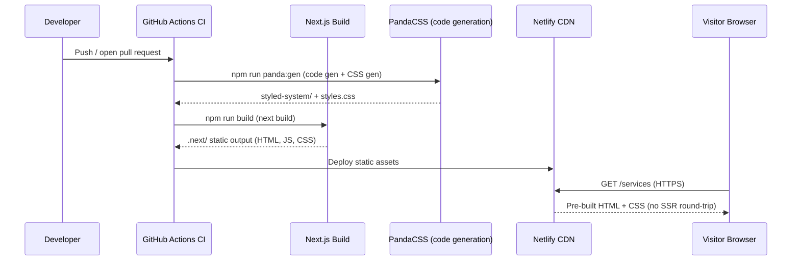
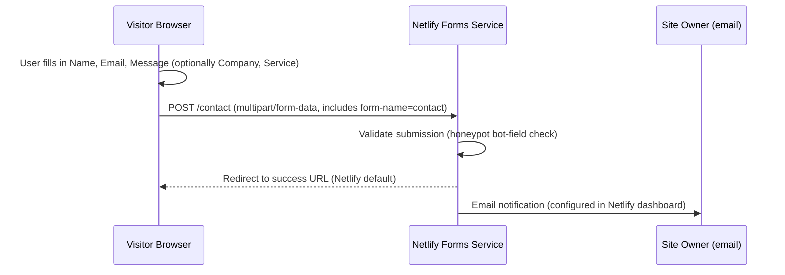

# Data Flows

This document describes how data moves through Sustainable Websites 2.0 at
runtime and during form submission.

## Page Rendering — Static Site Generation (SSG)

All pages are Server Components rendered at build time by Next.js (SSG). The
browser receives complete HTML from Netlify's CDN; no client-side data fetching
occurs.

### Key points

- PandaCSS code generation runs before every `next build` (see `prebuild` in
  `package.json`), producing `styled-system/` artifacts and a single
  `styles.css`.
- `next.config.ts` enables `compress: true` and removes the `X-Powered-By`
  header.
- Each page exports a `metadata` object (title, description) consumed by
  Next.js to generate `<head>` tags at build time — no runtime metadata
  resolution.
- The `Header` component reads navigation links from the static `siteConfig`
  object; no API call is involved.

## Contact Form Submission — Netlify Forms

The `/contact` page renders a plain HTML form with `data-netlify="true"`. Form
processing is handled entirely by Netlify's edge network; no custom API route or
server function is required.

### Form submission details

- `data-netlify="true"` on the `<form>` element instructs Netlify to intercept
  submissions at the edge.
- A hidden `<input name="form-name" value="contact">` field identifies the form
  to Netlify.
- A honeypot `<input name="bot-field">` hidden with CSS catches automated
  submissions without a CAPTCHA.
- Required fields are `name`, `email`, and `message`; `company` and `service`
  are optional.
- No JavaScript fetch or client-side state management is involved; the form uses
  a native HTTP POST.
